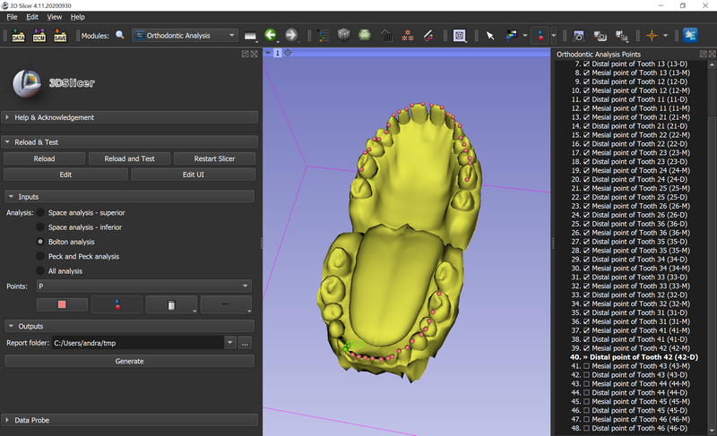

# Orthodontic analysis

This is an extension for [3D Slicer](https://www.slicer.org) to perform the most common dental analysis: model space discrepancies, Bolton and Peck and Peck.

## Instructions

All point instructions for performing the analysis are available in Python interactor after study method points are selected. The Analysis button shows the result.

The model discrepancy calculates the difference between the required space and the present space. If the difference is positive, there is an excess of space available, if the difference is negative, it means that there is a space deficit.

The required upper and lower spaces are obtained from measurements of the mesiodistal diameters of the incisors, canines, and premolars. The present spaces are obtained in six straight line segments: from the mesial face of the first molar to the distal face of the canine, from the distal face of the canine to the mesial face of the canine and from the mesial face of the canine to the midline.

Bolton's analysis takes into account two proportional size ratios between the upper and lower arches. The first is based on the sums of mesiodistal diameters of the teeth from the first molars, including the same, totaling 12 teeth per arch. The second is based on the sums of mesiodistal diameters of the teeth from the canines, including the canines, totaling 6 teeth per arch.

The teeth evaluated in Peck and Peck analysis are the lower incisors. The measurements taken are the mesiodistal and buccolingual diameters. The value of the mesiodistal diameter is divided by the buccolingual diameter to obtain the proportion and make the evaluation.
